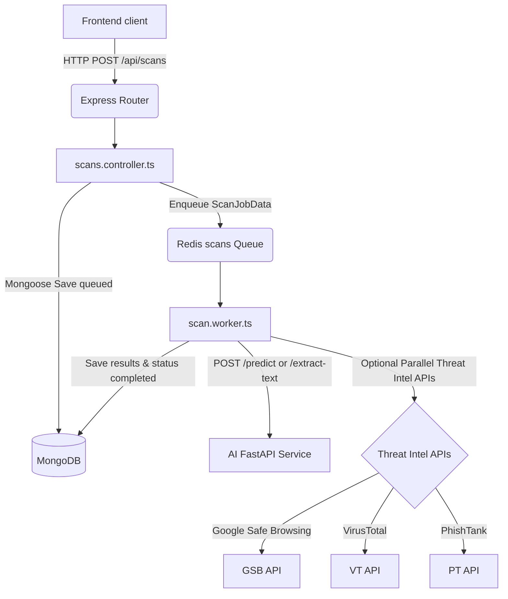

# ScamGuard - Comprehensive Technical Project Explanation

This document provides a complete technical deep-dive into the **ScamGuard** project. It details the architecture, design choices, file-by-file topology, operations, pipelines, databases, testing suites, and data flows of the entire application.

---

## 1. Executive Summary & Core Concept

**ScamGuard** is a multi-service platform built to detect digital scams, educate users about common social engineering techniques, and provide incident reporting tools. 

The architecture is composed of:
1. **Frontend App**: A single-page application (SPA) built using React, TypeScript, and Vite.
2. **Backend API**: A Node.js + Express REST API written in TypeScript, using MongoDB for persistence, Redis for session caching, and BullMQ for message queue background processing.
3. **AI Service**: A Python-based FastAPI microservice running a Hugging Face Transformers model (DistilBERT) for text classification and a Tesseract pipeline for Optical Character Recognition (OCR).

The codebase is structured as a monorepo consisting of multiple runtime directories under the main workspace root directory: [ScamGuard](file:///C:/Users/krish/OneDrive/Desktop/Projects/ScamGuard).

---

## 2. Directory Structure and Repository Topology

Below is the layout of the primary folders in the workspace:

* **[project/](file:///C:/Users/krish/OneDrive/Desktop/Projects/ScamGuard/project)**: The main application root containing the frontend, backend, and AI service.
  * **[src/](file:///C:/Users/krish/OneDrive/Desktop/Projects/ScamGuard/project/src)**: React, TypeScript, and Tailwind CSS frontend source files.
  * **[backend/](file:///C:/Users/krish/OneDrive/Desktop/Projects/ScamGuard/project/backend)**: Express backend with Mongoose schemas, controllers, and workers.
  * **[ai-service/](file:///C:/Users/krish/OneDrive/Desktop/Projects/ScamGuard/project/ai-service)**: Python FastAPI machine learning and OCR service.
  * **[docs/](file:///C:/Users/krish/OneDrive/Desktop/Projects/ScamGuard/project/docs)**: Auxiliary runbooks and operational guidelines.
  * **[e2e/](file:///C:/Users/krish/OneDrive/Desktop/Projects/ScamGuard/project/e2e)**: Playwright end-to-end browser tests.
* **[package.json](file:///C:/Users/krish/OneDrive/Desktop/Projects/ScamGuard/package.json)**: Workspace-level dependency manifest (contains tool dependencies like playwright, vitest, msw, etc.).

---

## 3. Technology Stack

### Frontend
* **React 18**: View library.
* **TypeScript**: Static typing.
* **Vite**: Modern bundler and dev server.
* **Tailwind CSS**: Utility-first CSS styling.
* **React Router v7**: Declarative routing.
* **Axios**: HTTP client.
* **Sentry React**: Error monitoring.

### Backend
* **Node.js (ESM)**: Server runtime environment.
* **Express**: REST API framework.
* **Mongoose (MongoDB)**: Object Document Mapper (ODM).
* **Redis**: Caching and job queue broker.
* **BullMQ**: Job queue management.
* **Winston**: JSON logging framework.
* **OpenTelemetry SDK**: Distributed tracing instrumentation.
* **bcrypt & jsonwebtoken**: Passwords and auth tokens.
* **Zod**: Type-safe schema validation for environment configuration.
* **Helmet & Express Rate Limit**: Basic security headers and abuse mitigation.

### AI Service
* **Python 3.10+**: Runtime language.
* **FastAPI & Uvicorn**: API framework and ASGI server.
* **PyTorch & Transformers**: Deep learning model pipeline.
* **DistilBERT**: Standard pre-trained NLP classification model.
* **Pytesseract (Tesseract OCR) & Pillow**: Image processing and text extraction.
* **Pydantic**: Data validation schemas.

---

## 4. Frontend Deep-Dive (`src/`)

The frontend application source code is located in the **[src/](file:///C:/Users/krish/OneDrive/Desktop/Projects/ScamGuard/project/src)** folder.

### 4.1. Application Initialization & Shell
* **[src/main.tsx](file:///C:/Users/krish/OneDrive/Desktop/Projects/ScamGuard/project/src/main.tsx)**: Registers the React DOM root, mounts the app shell wrapped in the root-level routing context (`BrowserRouter`), custom `ErrorBoundary` component, and Sentry error boundaries.
* **[src/App.tsx](file:///C:/Users/krish/OneDrive/Desktop/Projects/ScamGuard/project/src/App.tsx)**: Represents the layout skeleton. Wraps the application inside `AuthProvider` and coordinates the routing layout:
  * `/` links to the **[Hero.tsx](file:///C:/Users/krish/OneDrive/Desktop/Projects/ScamGuard/project/src/components/Hero.tsx)** component.
  * `/checker` links to the **[ScamChecker.tsx](file:///C:/Users/krish/OneDrive/Desktop/Projects/ScamGuard/project/src/components/ScamChecker.tsx)** component.
  * `/learn` links to the **[Education.tsx](file:///C:/Users/krish/OneDrive/Desktop/Projects/ScamGuard/project/src/components/Education.tsx)** component.
  * `/quiz` links to the **[Quiz.tsx](file:///C:/Users/krish/OneDrive/Desktop/Projects/ScamGuard/project/src/components/Quiz.tsx)** component.

### 4.2. UI Components
* **[src/components/Header.tsx](file:///C:/Users/krish/OneDrive/Desktop/Projects/ScamGuard/project/src/components/Header.tsx)**: Navigation header providing links to sections with conditional styling representing the active route.
* **[src/components/Hero.tsx](file:///C:/Users/krish/OneDrive/Desktop/Projects/ScamGuard/project/src/components/Hero.tsx)**: Landing page banner with primary Call-to-Action (CTA) buttons routing the user to the checker.
* **[src/components/ScamChecker.tsx](file:///C:/Users/krish/OneDrive/Desktop/Projects/ScamGuard/project/src/components/ScamChecker.tsx)**: Handles text, URL, and image upload submissions. When the API client is operational, it submits the scan and polls for results. If the API client fails (network failure, credentials missing, or server down), it automatically triggers a local fallback heuristic analysis.
* **[src/components/Education.tsx](file:///C:/Users/krish/OneDrive/Desktop/Projects/ScamGuard/project/src/components/Education.tsx)**: Interactive card-based panel detailing different types of scams (SMS, Email, Call, Suspicious URLs), checklists, and red flags.
* **[src/components/Quiz.tsx](file:///C:/Users/krish/OneDrive/Desktop/Projects/ScamGuard/project/src/components/Quiz.tsx)**: Gamified security awareness test featuring anti-scam scenario questions, scoring, and performance explanations.
* **[src/components/Footer.tsx](file:///C:/Users/krish/OneDrive/Desktop/Projects/ScamGuard/project/src/components/Footer.tsx)**: Footer displaying emergency hotlines, cybersecurity resources, and quick links.
* **[src/components/ErrorBoundary.tsx](file:///C:/Users/krish/OneDrive/Desktop/Projects/ScamGuard/project/src/components/ErrorBoundary.tsx)**: Catches React render crashes, displays a user-friendly error layout, and prompts a page reload button.

### 4.3. API Integration & fallbacks
* **[src/api/client.ts](file:///C:/Users/krish/OneDrive/Desktop/Projects/ScamGuard/project/src/api/client.ts)**: Configures Axios with base URL `http://localhost:3000` (or `VITE_API_URL`). Intercepts outgoing requests to attach JWT access tokens. If a request returns `401 Unauthorized`, it attempts a silent token refresh using the token stored in `localStorage` to replay the original request.
* **[src/api/scans.ts](file:///C:/Users/krish/OneDrive/Desktop/Projects/ScamGuard/project/src/api/scans.ts)**: Submits scan requests (`submitScan`), fetches results (`getScanResult`), retrieves paginated user scan history (`getUserScans`), and polls background job results (`pollScanResult`). Automatically falls back to local heuristics via `shouldUseLocalFallback` if connection fails.
* **[src/api/localAnalysis.ts](file:///C:/Users/krish/OneDrive/Desktop/Projects/ScamGuard/project/src/api/localAnalysis.ts)**: Implements local regular expressions and keyword checks for text cues (financial pressure, urgency, emotional manipulation, credential checks) and URL anomalies (IP addresses, internationalized domains, insecure HTTP protocols, tracking tags, URL shorteners) to analyze inputs client-side when the backend is offline.

### 4.4. Auth Context & Hooks
* **[src/context/AuthContext.tsx](file:///C:/Users/krish/OneDrive/Desktop/Projects/ScamGuard/project/src/context/AuthContext.tsx)**: Manages global authentication state, handles registration/login requests, stores JWT access/refresh tokens in localStorage, and decodes user role information.
* **[src/hooks/useAuth.ts](file:///C:/Users/krish/OneDrive/Desktop/Projects/ScamGuard/project/src/hooks/useAuth.ts)**: Simple custom hook to fetch authentication context data quickly.

---

## 5. Backend Architecture (`backend/`)

The backend service source is located in **[backend/src/](file:///C:/Users/krish/OneDrive/Desktop/Projects/ScamGuard/project/backend/src)**.



### 5.1. Startup & Composition
* **[backend/src/server.ts](file:///C:/Users/krish/OneDrive/Desktop/Projects/ScamGuard/project/backend/src/server.ts)**: Application bootstrap file. Imports OpenTelemetry instrumentation, initializes Sentry, establishes database connections (MongoDB/Redis), starts BullMQ scan workers, schedules background cleanups, and spins up the Express server listening on the configured port.
* **[backend/src/app.ts](file:///C:/Users/krish/OneDrive/Desktop/Projects/ScamGuard/project/backend/src/app.ts)**: Configures Express app options, including:
  * JSON and URL-encoded payloads (capped at 10MB).
  * CORS origin rules.
  * Helmet security headers (with custom CSP).
  * Global rate limiting (100 requests per 15 minutes by default).
  * Request logging, compression, and metric tracking.
  * Health check routing (`/health`).
  * API route groups mounting under `/api/...`.
* **[backend/src/instrumentation.ts](file:///C:/Users/krish/OneDrive/Desktop/Projects/ScamGuard/project/backend/src/instrumentation.ts)**: Initializes the OpenTelemetry Node SDK, setting up auto-instrumentation rules for Express routers, MongoDB databases, Redis calls, and outgoing HTTP requests.

### 5.2. Core Schemas & Database Models
Models are located in the **[backend/src/models/](file:///C:/Users/krish/OneDrive/Desktop/Projects/ScamGuard/project/backend/src/models)** directory:
* **[User.ts](file:///C:/Users/krish/OneDrive/Desktop/Projects/ScamGuard/project/backend/src/models/User.ts)**: Represents user profiles. Stores credentials, account statuses (verification, password resets), tracking statistics (scan count, scam detection rate), and security awareness score calculations.
* **[Scan.ts](file:///C:/Users/krish/OneDrive/Desktop/Projects/ScamGuard/project/backend/src/models/Scan.ts)**: Stores scan configurations, text/image parameters, processing times, statuses (queued, processing, completed, failed), threat intelligence records, and AI prediction results.
* **[Report.ts](file:///C:/Users/krish/OneDrive/Desktop/Projects/ScamGuard/project/backend/src/models/Report.ts)**: Incident report records containing scam categories, content descriptions, reporter lists, and moderation status flags.
* **[Conversation.ts](file:///C:/Users/krish/OneDrive/Desktop/Projects/ScamGuard/project/backend/src/models/Conversation.ts)**: Chat log collection tracking conversation arrays between users and the AI assistant.
* **[QuizResult.ts](file:///C:/Users/krish/OneDrive/Desktop/Projects/ScamGuard/project/backend/src/models/QuizResult.ts)**: Captures quiz scoring stats, correct answer records, and the time taken for each attempt.

### 5.3. Routes & Request Controllers
Routes are defined under **[backend/src/routes/](file:///C:/Users/krish/OneDrive/Desktop/Projects/ScamGuard/project/backend/src/routes)** and call respective handlers in **[backend/src/controllers/](file:///C:/Users/krish/OneDrive/Desktop/Projects/ScamGuard/project/backend/src/controllers)**:
* **[auth.routes.ts](file:///C:/Users/krish/OneDrive/Desktop/Projects/ScamGuard/project/backend/src/routes/auth.routes.ts)** / **[auth.controller.ts](file:///C:/Users/krish/OneDrive/Desktop/Projects/ScamGuard/project/backend/src/controllers/auth.controller.ts)**: Handles registration, login (JWT issue), refresh tokens, password resets, and user info lookup.
* **[user.routes.ts](file:///C:/Users/krish/OneDrive/Desktop/Projects/ScamGuard/project/backend/src/routes/user.routes.ts)** / **[user.controller.ts](file:///C:/Users/krish/OneDrive/Desktop/Projects/ScamGuard/project/backend/src/controllers/user.controller.ts)**: Handles user profile configurations, deleting accounts (GDPR Right to Erasure), theme toggles, and notification preferences.
* **[scans.routes.ts](file:///C:/Users/krish/OneDrive/Desktop/Projects/ScamGuard/project/backend/src/routes/scans.routes.ts)** / **[scans.controller.ts](file:///C:/Users/krish/OneDrive/Desktop/Projects/ScamGuard/project/backend/src/controllers/scans.controller.ts)**: Supports submitting scans (accepts job and enqueues to Redis), fetching results, listing paginated history, and deleting scans.
* **[reports.routes.ts](file:///C:/Users/krish/OneDrive/Desktop/Projects/ScamGuard/project/backend/src/routes/reports.routes.ts)** / **[report.controller.ts](file:///C:/Users/krish/OneDrive/Desktop/Projects/ScamGuard/project/backend/src/controllers/report.controller.ts)**: Endpoint for user-reported scam inputs, moderation updates, and public incident feeds.
* **[analytics.routes.ts](file:///C:/Users/krish/OneDrive/Desktop/Projects/ScamGuard/project/backend/src/routes/analytics.routes.ts)** / **[analytics.controller.ts](file:///C:/Users/krish/OneDrive/Desktop/Projects/ScamGuard/project/backend/src/controllers/analytics.controller.ts)**: Gathers user scan metrics, scam level distributions, and quiz score averages.
* **[assistant.routes.ts](file:///C:/Users/krish/OneDrive/Desktop/Projects/ScamGuard/project/backend/src/routes/assistant.routes.ts)** / **[assistant.controller.ts](file:///C:/Users/krish/OneDrive/Desktop/Projects/ScamGuard/project/backend/src/controllers/assistant.controller.ts)**: Handles chat operations with the virtual educational assistant.

### 5.4. Queues, Workers, and Background Jobs
* **[scan.queue.ts](file:///C:/Users/krish/OneDrive/Desktop/Projects/ScamGuard/project/backend/src/queues/scan.queue.ts)**: Defines the BullMQ Redis queue `scans`. Configures attempts (retries 2 times with exponential backoff delay of 2 seconds) and job expiration settings.
* **[scan.worker.ts](file:///C:/Users/krish/OneDrive/Desktop/Projects/ScamGuard/project/backend/src/workers/scan.worker.ts)**: Worker script subscribing to the `scans` queue. Executes task operations:
  * For text, calls the Python AI Service `/predict` endpoint.
  * For URLs, analyzes using both the AI Service and parallel third-party lookups:
    * **Google Safe Browsing**: Checks against known threats (malware, phishing, social engineering).
    * **VirusTotal**: Submits URLs to scan for malicious indicators.
    * **PhishTank**: Queries PhishTank database records.
  * For images, calls the Python AI Service `/extract-text` OCR endpoint first, then feeds the extracted text into the predictive analysis pipeline.
  * Updates MongoDB with the scan results and logs events.
* **[retention.ts](file:///C:/Users/krish/OneDrive/Desktop/Projects/ScamGuard/project/backend/src/jobs/retention.ts)**: Scheduled cron task (runs daily at 2:00 AM UTC) to automatically delete database records (scans and chats) older than `DATA_RETENTION_DAYS` (default is 90 days), complying with GDPR data minimization regulations.

---

## 6. Python AI & ML Service (`ai-service/`)

The Python FastAPI backend service is located in the **[ai-service/](file:///C:/Users/krish/OneDrive/Desktop/Projects/ScamGuard/project/ai-service)** folder.

### 6.1. Startup & Application Wrapper
* **[main.py](file:///C:/Users/krish/OneDrive/Desktop/Projects/ScamGuard/project/ai-service/app/main.py)**: Configures the FastAPI app, manages lifecycle states (loads the ML model and verifies Tesseract on start), configures CORS origins, and defines the HTTP endpoints:
  * `GET /health`: Health status (checks NLP model and OCR load status).
  * `POST /predict`: Performs text-based risk scoring.
  * `POST /extract-text`: Accepts file uploads, extracts strings, and returns text content.

### 6.2. ML Predictor Pipeline
* **[ml_model.py](file:///C:/Users/krish/OneDrive/Desktop/Projects/ScamGuard/project/ai-service/app/ml_model.py)**: Orchestrates the risk classification pipeline:
  1. Loads tokenizer and model configurations from Hugging Face (`distilbert-base-uncased` by default).
  2. Normalizes input and truncates texts to 5000 characters maximum before tokenization.
  3. Extracts linguistic warning cues (urgency words, financial pressure, emotional manipulation).
  4. Tokenizes text to 512 dimensions, passes it through the classifier model, and applies softmax.
  5. Computes a combined risk score (up to 70% from model probability, and up to 30% from linguistic cues).
  6. Maps scores to levels (`low` < 30, `medium` < 70, `high` >= 70).
  7. Generates warnings if classification confidence is below 70%.

### 6.3. OCR Image Processing
* **[ocr.py](file:///C:/Users/krish/OneDrive/Desktop/Projects/ScamGuard/project/ai-service/app/ocr.py)**: Checks Tesseract command availability during setup. Extracts text from raw image bytes using Pillow and Tesseract Engine wrappers.

### 6.4. Schemas & Threat Intel Placeholders
* **[models.py](file:///C:/Users/krish/OneDrive/Desktop/Projects/ScamGuard/project/ai-service/app/models.py)**: Enforces Pydantic model configurations for prediction inputs, outputs, and validation bounds.
* **[threat_intel.py](file:///C:/Users/krish/OneDrive/Desktop/Projects/ScamGuard/project/ai-service/app/threat_intel.py)**: Defines parallelized python-side placeholders for Google Safe Browsing, VirusTotal, and PhishTank lookup requests.

---

## 7. Configuration & Environment Variables

Environment variables are validated on start. Detailed guidelines are available in **[ENVIRONMENT_VARIABLES.md](file:///C:/Users/krish/OneDrive/Desktop/Projects/ScamGuard/project/ENVIRONMENT_VARIABLES.md)**:

### Backend Configuration
* **Server**: `NODE_ENV`, `PORT`
* **Databases**: `MONGODB_URI`, `REDIS_URL`, `REDIS_PASSWORD`
* **Tokens**: `JWT_SECRET`, `JWT_REFRESH_SECRET`, `JWT_EXPIRES_IN`, `JWT_REFRESH_EXPIRES_IN`
* **Third Party APIs**: `GOOGLE_SAFE_BROWSING_API_KEY`, `VIRUSTOTAL_API_KEY`
* **Integrations**: `AI_SERVICE_URL`, `AI_SERVICE_TIMEOUT`
* **Compliance**: `DATA_RETENTION_DAYS` (Default: 90)

### AI Service Configuration
* **Model**: `MODEL_PATH` (Default: `distilbert-base-uncased`)
* **OCR**: `OCR_LANGUAGE` (Default: `eng`)
* **Size limitations**: `MAX_IMAGE_SIZE_MB` (Default: 5)

---

## 8. Development, Deployment, and Verification Scripts

The project can be run locally using the commands defined in the manifests:

### 8.1. Running the Application

#### Option A: Docker Compose (Recommended)
Builds and starts all components (React frontend, Node API, FastAPI ML service, MongoDB, Redis) concurrently:
```bash
docker-compose up --build
```

#### Option B: Manual Startup
1. **AI Service**:
   ```bash
   cd ai-service
   python -m venv venv
   source venv/bin/activate
   pip install -r requirements-dev.txt
   python -m app.main
   ```
2. **Backend**:
   ```bash
   cd backend
   npm install
   npm run dev
   ```
3. **Frontend**:
   ```bash
   npm install
   npm run dev
   ```

### 8.2. Running Tests
The project features a highly thorough test suite described in **[TESTING_GUIDE.md](file:///C:/Users/krish/OneDrive/Desktop/Projects/ScamGuard/project/TESTING_GUIDE.md)**:

* **Backend Tests (Vitest)**: Tests Mongoose schemas, controllers, and workers.
  ```bash
  cd backend
  npm test
  ```
* **AI Service Tests (Pytest)**: Validates classification pre-processing, endpoint routing, and uses the **Hypothesis** framework for property-based boundary testing.
  ```bash
  cd ai-service
  python -m pytest
  ```
* **Frontend Tests (Vitest)**: Uses Mock Service Worker (MSW) to verify React router navigations, form submissions, and authentication states.
  ```bash
  npm run test
  ```
* **E2E Tests (Playwright)**: Automates browser tests simulating registrations, logins, and scan interactions.
  ```bash
  npm run test:e2e
  ```

---

## 9. Operational & Observability Guides

Detailed monitoring and deployment strategies are configured inside the documentation files:
* **[OBSERVABILITY.md](file:///C:/Users/krish/OneDrive/Desktop/Projects/ScamGuard/project/OBSERVABILITY.md)**: Documents Winston structured logging configurations, Prometheus metric definitions (`/metrics` endpoint exposing HTTP duration and scan processing depth), Sentry SDK configurations, and OpenTelemetry setup for tracing request scopes.
* **[DEVOPS_GUIDE.md](file:///C:/Users/krish/OneDrive/Desktop/Projects/ScamGuard/project/DEVOPS_GUIDE.md)**: Details multi-stage production Docker configurations, deployment architecture patterns, and GitHub Actions CI pipelines (handling checks, lints, builds, and docker pushes).
* **[docs/alerting-runbook.md](file:///C:/Users/krish/OneDrive/Desktop/Projects/ScamGuard/project/docs/alerting-runbook.md)**: On-call playbook detailing troubleshooting steps, thresholds, and mitigations for alerts (e.g. AI latency, elevated HTTP error rates, Redis/Mongo outages).

---

## 10. Core Technical Data Flow Walkthrough

The step-by-step lifecycle of a user scam detection check follows this path:

1. **Submission**: A user posts an input on the React **[ScamChecker.tsx](file:///C:/Users/krish/OneDrive/Desktop/Projects/ScamGuard/project/src/components/ScamChecker.tsx)** form.
2. **REST API Handshake**: The browser makes an authorized HTTP request (`POST /api/scans`) to the Express backend.
3. **Queuing**: The backend router maps the request to **[scans.controller.ts](file:///C:/Users/krish/OneDrive/Desktop/Projects/ScamGuard/project/backend/src/controllers/scans.controller.ts)**, which creates a new `Scan` document in MongoDB with `queued` status, enqueues a `ScanJobData` structure to the Redis-backed BullMQ `scans` queue, and immediately returns a `202 Accepted` status with the job ID to the client.
4. **Polling**: The React frontend client enters a loop, querying the status (`GET /api/scans/:id`) every 1.5 seconds.
5. **Background Processing**: The BullMQ **[scan.worker.ts](file:///C:/Users/krish/OneDrive/Desktop/Projects/ScamGuard/project/backend/src/workers/scan.worker.ts)** retrieves the job:
   * If the type is an image, the worker calls the Python AI Service `/extract-text` endpoint to retrieve raw strings.
   * The worker sends the target text to the `/predict` FastAPI endpoint.
   * The Python **[ml_model.py](file:///C:/Users/krish/OneDrive/Desktop/Projects/ScamGuard/project/ai-service/app/ml_model.py)** tokenizes the input, extracts linguistic cues, scores them via DistilBERT, and calculates the combined risk score.
   * If the check type is a URL, the worker concurrently queries third-party threat feeds (Google Safe Browsing, VirusTotal, and PhishTank).
6. **Persistence**: The worker merges all results and updates the MongoDB document status to `completed` (or `failed` in case of error).
7. **Resolution**: The React frontend client's next poll returns the completed scan details, and the UI displays the risk score, warning cues, and security tips to the user.
